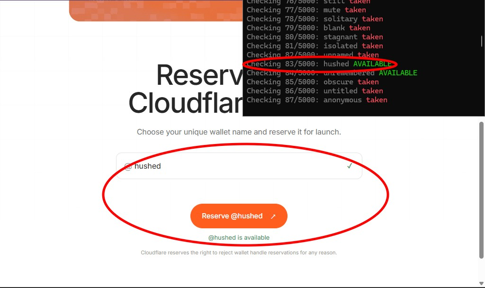

# cloudflare.pay username helper
run "python checker.py check"


A personal tool for picking your own handle on https://cloudflare.pay
(Cloudflare Wallet name reservation). It generates a big list of
candidate names in the styles you want, then checks them against the
site's real, live availability check by calling its own check API
directly over HTTP -- no browser involved.

**It never clicks "Reserve" and never submits anything.** The only
request it ever makes is a read-only `GET` to the same check endpoint
the site's own page calls as you type into its name box.

## Files

| File            | What it is                                             |
|-----------------|---------------------------------------------------------|
| `checker.py`    | the tool (two subcommands: `generate` and `check`)       |
| `usernames.txt` | generated candidate list (already pre-built, 5,000 one-word names) |
| `wordlist_pool.txt` | fill-in word pool used by `generate` once the hand-curated words are used up (see "Where the words come from" below) |
| `available.txt` | fills in as `check` runs -- confirmed-available names     |
| `checked.log`   | internal: every name already checked (used to resume)     |
| `errors.log`    | internal: names that failed to check (network hiccups, etc.), retried automatically next run |
| `requirements.txt` | Python dependency (just `requests`)                    |

## Requirements

- Python 3.10+ (the code uses `int | None`-style type hints, which need
  3.10 or newer)
- The `requests` package (see Install below)

## Install

```
cd cloudflare.py
pip install -r requirements.txt
```

That's it -- no browser download, no Playwright/Selenium, nothing else
to install. `requests` is a small, common library; there's a good chance
it's already on your system.

## Usage

`usernames.txt` already comes pre-generated with 5,000 one-word
candidates -- no numbers, no letter/number tags, no generated
combinations, ever. To regenerate it (e.g. with a different size or
shuffle seed):

```
python checker.py generate --count 5000 --seed 7
```

Then check them against the live site:

```
python checker.py check
```

You'll see progress like:

```
Checking 45/5000: dossier AVAILABLE
Checking 46/5000: sealed taken
```

Every confirmed-available name is written to `available.txt` immediately,
as soon as it's found:

```
coldcase
AVAILABLE

blackfile
AVAILABLE
```

### Stopping and resuming

Press `Ctrl+C` any time. You'll see:

```
Stopping... saving progress...
Stopped. Progress saved -- rerun to resume.
```

It exits within a few seconds -- in-flight requests get a brief moment to
finish and save their result, but shutdown never hangs waiting on them.
Run `python checker.py check` again later and it picks up where it left
off (names already checked are skipped, tracked in `checked.log`).

### Useful flags

```
python checker.py check --limit 200          # only check the next 200 names
python checker.py check --delay-min 0.8 --delay-max 1.5   # slower / gentler pacing
```

## Performance and resource usage

Checking runs concurrently across multiple workers, controlled by one
setting near the top of `checker.py`:

```python
WORKERS = 15
```

Each worker is just a `requests.Session` -- a small HTTP connection pool,
not a process -- so this is cheap to run at 15 (or higher, if you want;
raise it freely). There's no browser of any kind anywhere in this tool
anymore: no Playwright, no Selenium, no Chrome/Chromium/chrome-headless-shell
process ever gets launched. In testing, 200 concurrent-checked usernames
completed in about 17 seconds using a few milliseconds of actual CPU
time, with zero browser processes at any point.

What keeps it light:
- **One `requests.Session` per worker, reused for the whole run** --
  sessions keep a small, self-managed connection pool open to the site;
  nothing here grows unbounded the way a browser page's memory can.
- **Batched, size-bounded work queue** -- usernames are fed into the
  queue a batch at a time (`BATCH_QUEUE_MAXSIZE` in `checker.py`) as
  workers consume them, instead of loading the whole run's remaining
  list into the queue up front.
- **Guaranteed cleanup** -- every worker's session is closed in a
  `finally` block, whether it finishes normally, hits an error, or gets
  interrupted.

## How it works

cloudflare.pay's reservation page has one input box. As you type into it,
the page itself calls `GET /api/check?tag=<name>` and shows you a live
result -- nothing is reserved until you separately click "Reserve".
Inspecting that page's own network traffic shows exactly what it sends;
this script calls that same endpoint directly, the exact same request,
just without a page or browser around it. The response is parsed the
same way either way: `available` / `taken` / `reserved` / `invalid`.

Both success (200) and reserved/invalid (400) responses come back with a
JSON body -- the HTTP status code itself is never inspected, only the
parsed `available`/`code` fields, exactly like before.

Naming rules enforced by the site itself (used to pre-filter the
generated list so we don't waste checks): lowercase letters, digits, and
hyphens only, 3-32 characters long.

## Where the words come from

`usernames.txt` is built in two tiers, in this order:

1. **Hand-curated (~374 words)** -- every entry genuinely matches the
   dark / classified / rare aesthetic: the original seed list plus
   themed expansions (erasure, secrecy, decay, shadow/night, fracture,
   digital/glitch, investigation, exile, occult, obsolete, weather,
   minerals) and natural inflections of the same roots (e.g. `erase` /
   `erasing` alongside `erased`). This tier always comes first in the
   file, so it's what gets checked first.
2. **`wordlist_pool.txt` fill-in (rest, up to the requested `--count`)**
   -- once the curated tier is used up, `generate` pulls real words from
   `wordlist_pool.txt`, a pre-filtered sample of the public
   [dwyl/english-words](https://github.com/dwyl/english-words) list
   (public domain / Unlicense). It's filtered to 4-14 letters, excludes
   the 10,000 most common English words (so what's left leans rare) and
   anything on a standard profanity/slur block list.

   **This tier is pre-ranked**, best-fit first, by a score combining:
   - length (4-9 letters scored highest, 10-12 lower, 13-14 lowest)
   - recognizability, via a 50k-word English frequency corpus (words
     that never show up in real usage score worst -- the main signal
     for "this is obscure technical jargon")
   - general theme match (+2/hit): shadow, silence, absence, memory,
     ruin, secrecy, records, night, cold, lost, unknown, erasure
   - a **stronger username-archetype layer** (+3/hit): codename/alias
     words, file/artifact/record words, forgotten-concept words, and
     dark-atmosphere words (phantom, ashen, umbra, gloom, hollow,
     sealed, redact, ...)
   - explicit penalties for mundane household verbs (defrost, repair,
     collect, wash, ...), household objects (chair, mattress, faucet,
     ...), and cheerful/no-atmosphere words (happy, cuddly, sunshine,
     ...) -- these are excluded from theme credit too, so a word like
     "defrost" doesn't sneak back up just for containing "frost"
   - a small penalty for words matching **no** theme/archetype signal
     at all, so plain-but-recognizable filler doesn't rank as high as
     genuinely on-theme words
   - the existing technical-suffix, mineral "-ite", place-name, and
     first-name/surname penalties from before

   `generate` reads this file top-to-bottom, so the best-scoring
   tier-2 words are always checked before the weaker ones. This is a
   keyword/frequency heuristic, not true semantic understanding --
   expect it to be meaningfully better than before but not perfect
   (a few odd dictionary compounds like "antifrost" or neutral words
   with no clean theme match can still rank higher than ideal).

If you only want the tightly-on-theme words, just take the first ~374
lines of `usernames.txt` (or check with `--limit 374`).

## Known limitations

- **Tier-2 ranking is a keyword/frequency heuristic, not true semantic
  understanding** (see above) -- occasional odd entries near the top of
  that tier are expected.
- **Tied to cloudflare.pay's current API.** If the site changes its
  check endpoint, request format, or response shape, `_check_one()` in
  `checker.py` is the only place that would need updating.
- **Developed and tested on Windows.** The code itself is plain Python +
  `requests` (no OS-specific dependencies besides an optional ANSI-color
  shim that's a no-op outside Windows), so it should run fine on
  macOS/Linux, but that hasn't been directly verified.
- **No built-in rate-limit backoff beyond per-request retries.** If
  cloudflare.pay ever starts rate-limiting aggressively, lower `WORKERS`
  and/or raise `--delay-min`/`--delay-max`.
